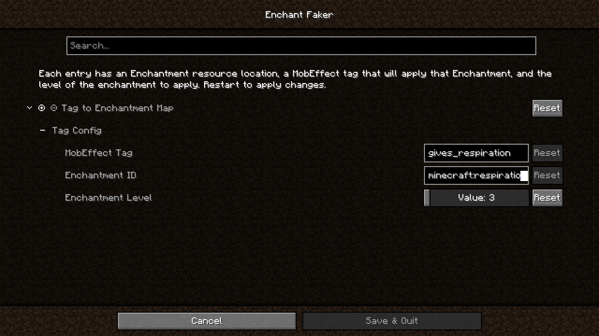

# Enchant Faker

Lets you apply enchantments to entities based on their current status effects.
The enchantments to apply are determined by mob_effect tags.

## Usage
Add tags via data pack at `data/enchant_faker/tags/mob_effect/`.

### Example
`data/enchant_faker/tags/mob_effect/gives_respiration.json`:
```json
{
    "replace": true,
    "values": [
        "spectral_seas:amphibious"
    ]
}
```

Add mappings to the configuration:


The resulting `enchant_faker.json5` config file:
```json5
{
	// Tag To Enchantment Mappings
	"tagConfig": [
		{
			"tag": "gives_respiration",
			"enchantment": "minecraft:respiration",
			"level": 3
		}
	]
}
```
Now, whenever an entity has the `spectral_seas:amphibious` effect, they will also get the Respiration III 
enchantment as if they were wearing a helmet enchanted with it.

You will need to restart Minecraft after any config changes.

## Acknowledgements

Inspired by [Lilligant](https://modrinth.com/mod/lilligant)

Icon: magic hat by ridhobadal from
[Noun Project](https://thenounproject.com/icon/magic-hat-3772576/) (CC BY 3.0)